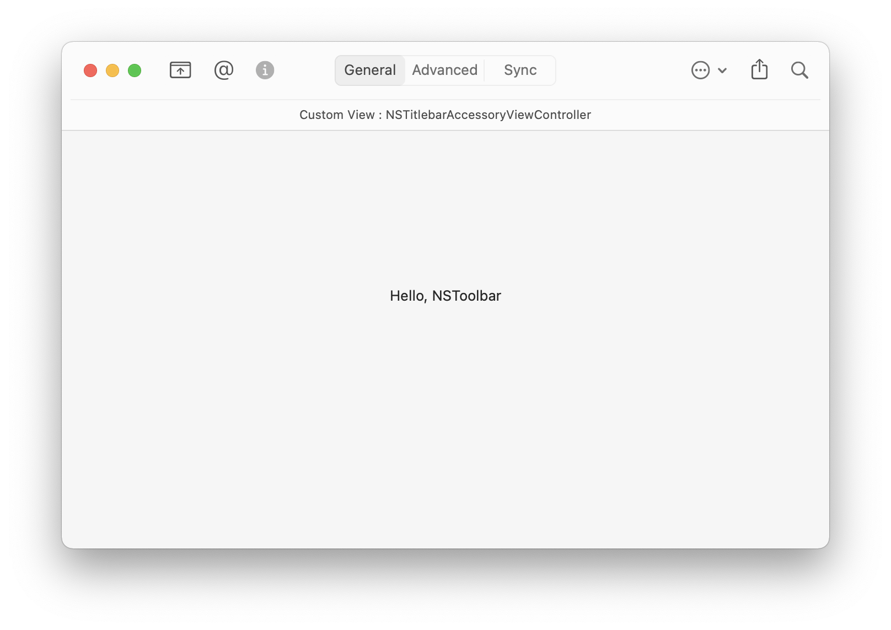
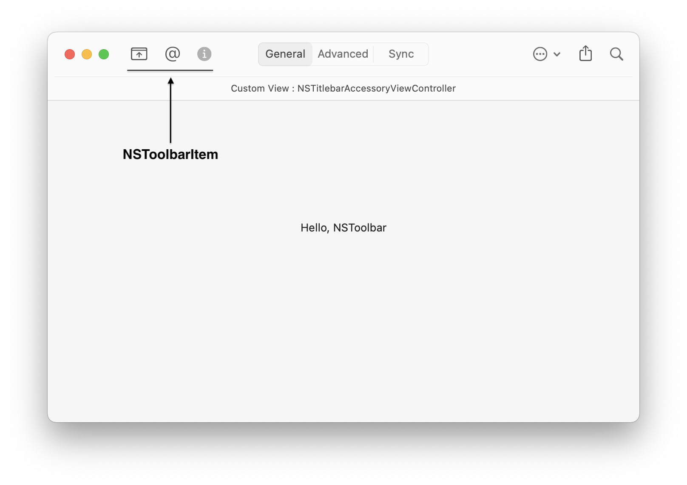
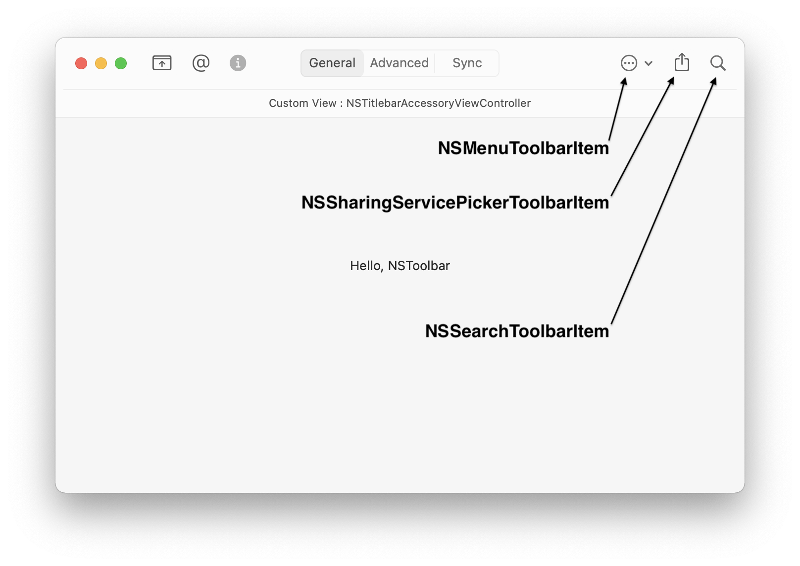
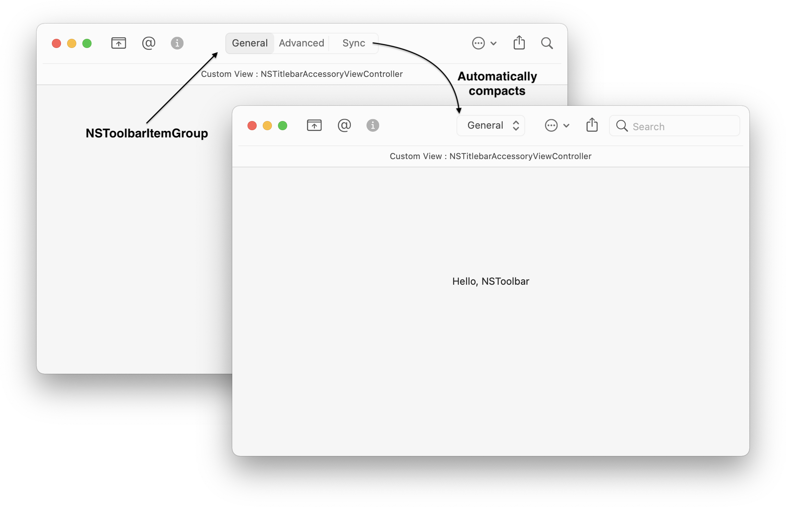
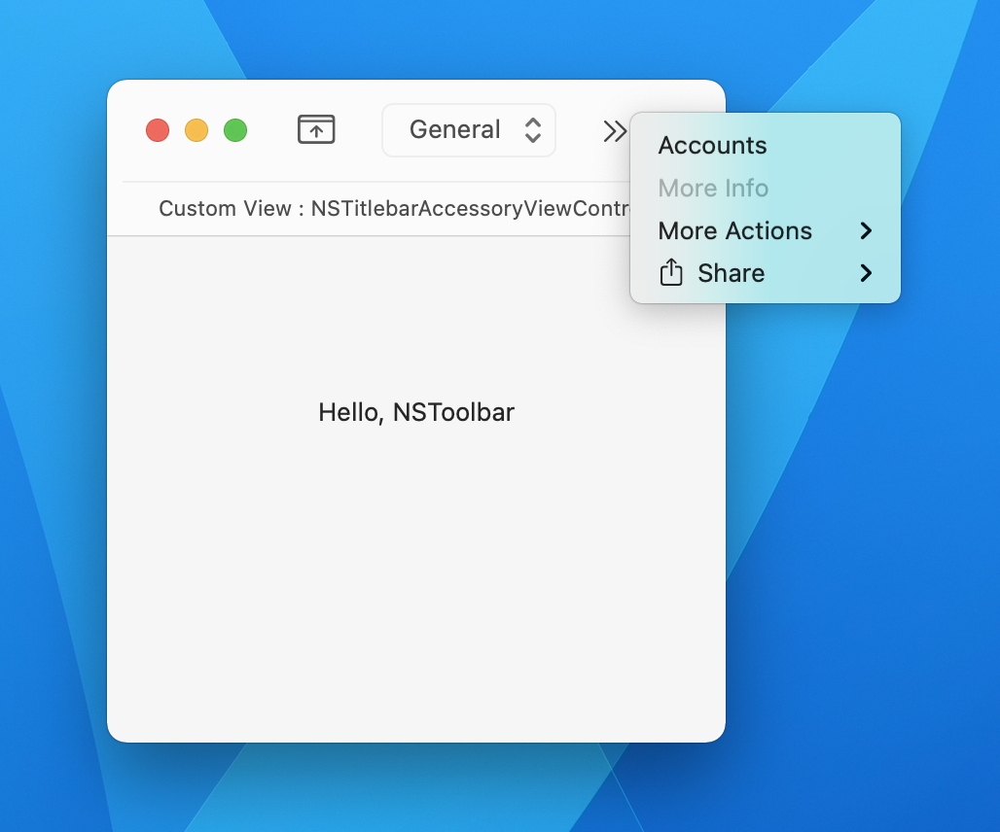
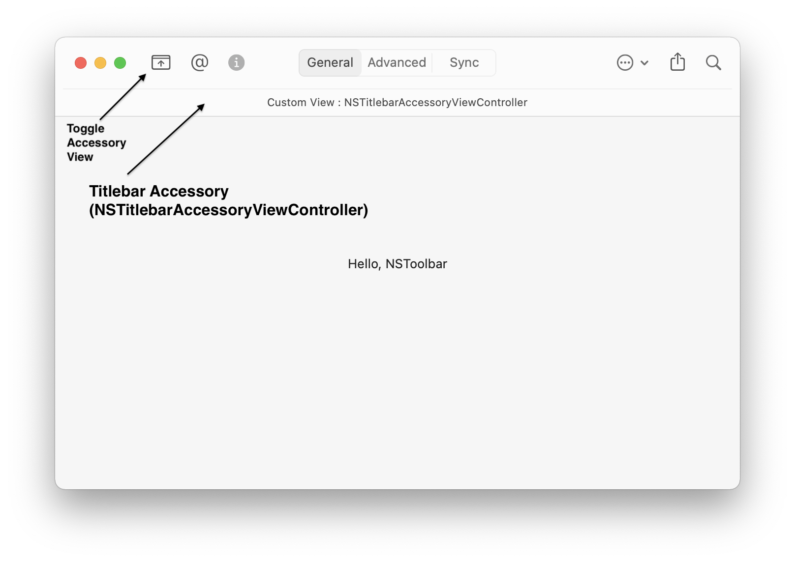
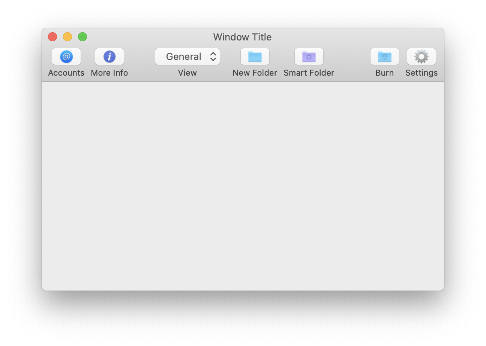
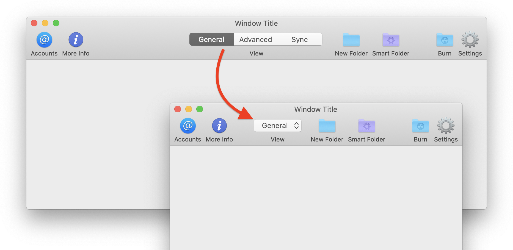

# toolbar (NSToolbar example)
### Programmatically constructing an NSToolbar (AppKit) for macOS.

Learn how to programmatically create an `NSToolbar` with `NSToolbarItem` and specialized versions of `NSToolbarItem` elements such as:

- `NSMenuToolbarItem` [View Documentation](https://developer.apple.com/documentation/appkit/nsmenutoolbaritem)
- `NSSharingServicePickerToolbarItem` [View Documentation](https://developer.apple.com/documentation/appkit/nssharingservicepicker)
- `NSSearchToolbarItem` [View Documentation](https://developer.apple.com/documentation/appkit/nssearchtoolbaritem)
- `NSToolbarItemGroup` [View Documentation](https://developer.apple.com/documentation/appkit/nstoolbaritemgroup)

in order to get expected behavior like menus, search bars, share options, and overflow items all for free.

### NSToolbarItemGroup

This particular item is special in that it displays as a segmented control and will collapse into a Popup Button when space is limited.

### Overflow and Visibility Priority

When a toolbar doesn't have enough space, it will start putting elements into the overflow menu. You can assign an overflow priority to your items so that some items will fall into the overflow menu before others. For example, an overflow priority of low will move that item into an overflow menu before others as horizontal space becomes more limited. See examples of this in the code.

## Titlebar Accessory

The titlebar accessory view controller is an additional view that can be attached to your window's titlebar or toolbar (if one was added). This isn't part of the Toolbar but it's a good UI element to know about it since it can complement it. You can add additional UI elements appropriate to the current context of your app. This example shows how to create and add an accessory view. For more information on `NSTitlebarAccessoryViewController`, check out Apple's [documentation](https://developer.apple.com/documentation/appkit/nstitlebaraccessoryviewcontroller).

One example of `NSTitlebarAccessoryViewController` is the Favorites bar in Safari on macOS. It shows a horizontal list of bookmarks you've favorited across and under the main toolbar. Just how you can toggle this Favorites bar on and off, this example code displays a toggle button as well to show or hide this accessory view.

## macOS Catalina and older

As of macOS Catalina, you can also set the `isBordered` element to gain an `NSButton` look and feel for free without having to set the `view` property of `NSToolbarItem` with an `NSButton`.

This example also goes over how to create  `NSToolbarItemGroup` to create an item that looks like an `NSSegmentedControl` that will automatically turn into a dropdown menu when space becomes limited. It will also add itself as a submenu to the overflow menu if the width space becomes severely limited.

